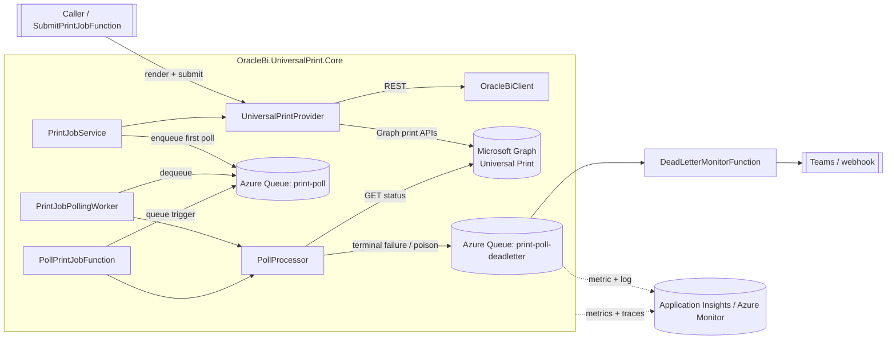

# Oracle BI → Microsoft Universal Print provider (C#)

A custom Microsoft **Universal Print** provider that renders reports from **Oracle BI Publisher**
and submits them to a Universal Print printer via the **Microsoft Graph** print APIs. It includes
production-grade **retry** and **telemetry** practices, **status polling** (both an in-process
background worker and an Azure Functions queue trigger), **Azure Queue** integration, and a
**dead-letter queue (DLQ)** with monitoring, alerting and job correlation.

---

## Architecture



OBI renders the report → `UniversalPrintProvider` creates a Graph print job, uploads the document
in chunks, and starts it → `PrintJobService` enqueues a poll message → a poller (worker **or**
function) checks status, **re-schedules** with back-off while printing, marks **completed**, or
**dead-letters** on permanent failure / timeout / poison.

---

## Project layout

| Path | Purpose |
| --- | --- |
| `src/OracleBi.UniversalPrint.Core` | Provider, Oracle BI client, queue + DLQ, polling, resilience, telemetry, DI |
| `src/OracleBi.UniversalPrint.Functions` | Submit (HTTP) + poll (queue) + DLQ-monitor (queue) functions |

Key types:

- [UniversalPrintProvider](src/OracleBi.UniversalPrint.Core/UniversalPrintIntegration/UniversalPrintProvider.cs) — the custom provider (Graph print job create → upload → start → status).
- [OracleBiClient](src/OracleBi.UniversalPrint.Core/OracleBiIntegration/OracleBiClient.cs) — BI Publisher REST render.
- [ResiliencePipelines](src/OracleBi.UniversalPrint.Core/Resilience/ResiliencePipelines.cs) — Polly v8 retry policies.
- [PrintTelemetry](src/OracleBi.UniversalPrint.Core/Telemetry/PrintTelemetry.cs) — `ActivitySource` + `Meter` (incl. DLQ metrics).
- [PollProcessor](src/OracleBi.UniversalPrint.Core/Polling/PollProcessor.cs) — host-agnostic poll/retry/dead-letter rules.
- [PrintJobPollingWorker](src/OracleBi.UniversalPrint.Core/Polling/PrintJobPollingWorker.cs) — background polling worker.
- [PollPrintJobFunction](src/OracleBi.UniversalPrint.Functions/PollPrintJobFunction.cs) — Azure Function queue trigger.
- [AzureStorageDeadLetterQueue](src/OracleBi.UniversalPrint.Core/Queueing/AzureStorageDeadLetterQueue.cs) — DLQ writes + telemetry.

---

## Retry & telemetry best practices

**Retry** (in [ResiliencePipelines](src/OracleBi.UniversalPrint.Core/Resilience/ResiliencePipelines.cs)):

- Retry **only transient** failures: `408`, `429`, `500`, `502`, `503`, `504`, `HttpRequestException`, timeouts.
- **Exponential back-off with jitter** to avoid synchronized retry storms.
- Honour **`Retry-After`** on `429`/`503` when present.
- **Bounded** attempts so a permanently broken dependency surfaces (and is dead-lettered) instead of looping forever.
- Request bodies are **rebuilt per attempt** so retried POSTs/PUTs are safe.

**Telemetry** (in [PrintTelemetry](src/OracleBi.UniversalPrint.Core/Telemetry/PrintTelemetry.cs)):

- One `ActivitySource` (`OracleBi.UniversalPrint`) for distributed tracing; every span is stamped with `print.correlation_id`.
- One `Meter` (`OracleBi.UniversalPrint`) exposing the metrics below.
- Exported to Application Insights/Azure Monitor via OpenTelemetry (see `Program.cs`).

| Metric | Type | Key dimensions |
| --- | --- | --- |
| `print.jobs.submitted` | counter | `printer.id` |
| `print.jobs.completed` | counter | `printer.id` |
| `print.jobs.failed` | counter | `printer.id`, `failure.reason` |
| `print.poll.attempts` | counter | `printer.id`, `result.state` |
| `print.poll.latency` | histogram (ms) | `printer.id` |
| `print.job.duration` | histogram (s) | `printer.id` |
| **`print.deadletter.count`** | **counter** | **`deadletter.reason`, `printer.id`** |

---

## Status polling design

A poll message (`{ correlationId, printerId, universalPrintJobId, pollAttempts }`) drives one status
check. The shared [PollProcessor](src/OracleBi.UniversalPrint.Core/Polling/PollProcessor.cs) decides:

- **Completed** → delete the message.
- **Still printing** → enqueue a new poll message with **exponential back-off** visibility delay (capped), incrementing `pollAttempts`.
- **Failed / aborted** → dead-letter (`PrintJobFailed`).
- **Exceeded `MaxPollAttempts`** → dead-letter (`PollTimeoutExceeded`).
- **Exceeded `MaxDeliveryAttempts` (dequeue count)** → dead-letter (`MaxDeliveryAttemptsExceeded`).
- **Undeserializable body** → dead-letter (`DeserializationFailure`).

Two interchangeable hosts use the same processor:

- **Background worker** — [PrintJobPollingWorker](src/OracleBi.UniversalPrint.Core/Polling/PrintJobPollingWorker.cs), a `BackgroundService` for Worker Service / App Service / container hosting. Register with `services.AddOracleBiUniversalPrint(config).AddPrintPollingWorker();`.
- **Azure Function** — [PollPrintJobFunction](src/OracleBi.UniversalPrint.Functions/PollPrintJobFunction.cs) (queue trigger), for serverless/event-driven hosting.

---

## Error handling & dead-letter queue logic

- Transient errors are retried in-pipeline; if they persist the message is **abandoned** back to the
  queue, its **dequeue count** climbs, and poison protection eventually dead-letters it.
- Terminal failures are written to the DLQ as a [DeadLetterEnvelope](src/OracleBi.UniversalPrint.Core/Models/DeadLetterEnvelope.cs)
  carrying the **`CorrelationId`**, a `ReasonCode`, the original poll message, delivery attempts, and error detail.
- Every DLQ write emits a `print.deadletter.count` metric **and** a structured `LogError`, so the event is both
  alertable (metric) and queryable/correlatable (log).
- The Azure Functions runtime additionally moves messages exceeding `host.json` `maxDequeueCount` to a
  `<queue>-poison` queue — a belt-and-braces safety net alongside the explicit DLQ.

---

## Monitoring & alerting on DLQ events

You have two complementary signals: the **metric** `print.deadletter.count` and the **log** event
`DEAD-LETTER print job …`. Use metrics for fast threshold alerts and logs for rich, correlated queries.

### Log-based alert (Application Insights, KQL)

Any DLQ event in the last 5 minutes:

```kusto
traces
| where timestamp > ago(5m)
| where message startswith "DEAD-LETTER print job"
| extend Reason = tostring(customDimensions.Reason),
         CorrelationId = tostring(customDimensions.CorrelationId),
         Printer = tostring(customDimensions.PrinterId)
| summarize Count = count() by Reason, Printer, bin(timestamp, 5m)
```

Create a **scheduled query (log) alert** in Azure Monitor on this query with threshold
`Count > 0` (or a per-reason threshold), evaluated every 5 minutes.

### Metric-based alert

Alert on the custom metric `print.deadletter.count`:

- **Signal**: `print.deadletter.count` (customMetrics)
- **Aggregation**: Sum over 5 minutes
- **Condition**: `> 0` for a hard SLA, or dynamic threshold for noisy environments
- **Split by dimension**: `deadletter.reason` and/or `printer.id` so each printer/reason alerts independently

Queue-depth alert (catches a backed-up DLQ even if the writer is down) — Storage Queue metric:

- **Resource**: the storage account → Queue service
- **Metric**: `QueueMessageCount` filtered to `print-poll-deadletter`
- **Condition**: `> 0` (warning) / `> N` (critical)

### Recommended alert tiers

| Severity | Trigger | Action |
| --- | --- | --- |
| Sev 3 (warn) | 1+ DLQ event in 15 min | Notify team channel |
| Sev 2 (high) | 5+ DLQ events in 5 min, or reason = `PrintJobFailed` spike | Page on-call (non-urgent) |
| Sev 1 (critical) | DLQ depth `> 50`, or DLQ rate breaches SLA | Page on-call (urgent) + auto-create incident |

---

## Dashboard widgets for DLQ monitoring

Build an Azure Workbook or Dashboard with these tiles:

1. **DLQ rate (line)** — `print.deadletter.count` summed by `bin(timestamp, 5m)`; overlay a threshold line.
2. **DLQ by reason (stacked column / pie)** — split `print.deadletter.count` by `deadletter.reason`
   (`MaxDeliveryAttemptsExceeded`, `PrintJobFailed`, `PollTimeoutExceeded`, `DeserializationFailure`, `UnhandledError`).
3. **DLQ by printer (bar, top-N)** — split by `printer.id` to spot a single failing printer.
4. **Current DLQ depth (single stat / gauge)** — Storage `QueueMessageCount` for `print-poll-deadletter`.
5. **Success vs dead-letter ratio (stat)** — `print.jobs.completed` ÷ (`completed` + `deadletter.count`).
6. **Recent dead-letters (grid/table)** — last 50 DLQ events with `CorrelationId`, `Reason`, `Printer`, `time`
   (drill-through to the job trace).
7. **End-to-end latency (histogram/percentiles)** — `print.job.duration` p50/p95/p99 to catch slow-printing trends before they time out.

Example grid query for tile 6:

```kusto
traces
| where message startswith "DEAD-LETTER print job"
| project timestamp,
          CorrelationId = tostring(customDimensions.CorrelationId),
          Reason = tostring(customDimensions.Reason),
          Printer = tostring(customDimensions.PrinterId),
          UniversalPrintJobId = tostring(customDimensions.UniversalPrintJobId),
          DeliveryAttempts = toint(customDimensions.DeliveryAttempts)
| order by timestamp desc
| take 50
```

---

## Notification methods for DLQ alerts

Pick based on urgency and audience — combine several:

| Method | Best for | How |
| --- | --- | --- |
| **Microsoft Teams / Slack** | Team awareness, triage | Azure Monitor **Action Group** → webhook, **or** the [DeadLetterMonitorFunction](src/OracleBi.UniversalPrint.Functions/DeadLetterMonitorFunction.cs) posting an Adaptive Card to an incoming webhook (near-real-time, per event) |
| **Email** | Low-urgency digests | Action Group → Email |
| **SMS / Voice / Push** | Sev 1 paging | Action Group → SMS/Voice/Azure mobile app push |
| **PagerDuty / Opsgenie / ServiceNow** | On-call rotation + incident records | Action Group → ITSM connector or partner webhook |
| **Logic App / Power Automate** | Custom routing, enrichment, ticketing | Action Group → Logic App; enrich with the job correlation id |
| **Azure Monitor Alerts** | The trigger layer behind all of the above | Metric/log alert → Action Group |

The included [DeadLetterMonitorFunction](src/OracleBi.UniversalPrint.Functions/DeadLetterMonitorFunction.cs)
triggers directly on the DLQ and posts an Adaptive Card to `Notifications:WebhookUrl` — set it to a
Teams/Slack incoming webhook or a Logic App URL. Leave it blank to disable outbound notifications and
rely solely on Azure Monitor alerts.

---

## Correlating DLQ events with print jobs

Correlation is built in via a single **`CorrelationId`** assigned when the job is created. It flows through:

1. **The print job** ([PrintJob.CorrelationId](src/OracleBi.UniversalPrint.Core/Models/PrintJob.cs)) and is returned to the caller.
2. **Traces** — every `Activity` is tagged `print.correlation_id` (see [PrintTelemetry](src/OracleBi.UniversalPrint.Core/Telemetry/PrintTelemetry.cs)).
3. **Poll messages** on the queue.
4. **The DLQ envelope** ([DeadLetterEnvelope.CorrelationId](src/OracleBi.UniversalPrint.Core/Models/DeadLetterEnvelope.cs)) and the structured `LogError`, where each field becomes a queryable `customDimension`.

To go from a DLQ event to the full job history in Application Insights:

```kusto
let cid = "PASTE_CORRELATION_ID";
union traces, dependencies, requests, exceptions
| where timestamp > ago(1d)
| where tostring(customDimensions.CorrelationId) == cid
      or tostring(customDimensions["print.correlation_id"]) == cid
| order by timestamp asc
```

This returns the submit, every Oracle BI render and Graph dependency call, all poll attempts, and the
final dead-letter event — the complete timeline for one job. To replay a dead-lettered job, read the
envelope's `OriginalMessage` from the DLQ and re-enqueue it onto `print-poll`.

---

## Setup

### Prerequisites

- .NET 10 SDK, Azure Functions Core Tools v4, Azurite (or a real storage account).
- An Entra ID app registration with **application** permissions `PrintJob.ReadWrite.All` and
  `Printer.Read.All` (admin consented). Prefer **managed identity** in Azure.
- A registered/shared Universal Print printer id.
- Oracle BI Publisher service account credentials (store secrets in Key Vault).

### Configure

Set values in `local.settings.json` (local) or app settings (Azure) — see
[local.settings.json](src/OracleBi.UniversalPrint.Functions/local.settings.json). Notable keys:

- `UniversalPrint:*` — tenant/client/secret (or `UseManagedIdentity=true`) and `DefaultPrinterId`.
- `OracleBi:*` — BI Publisher base URL + credentials. `BaseUrl` must be HTTPS unless
  `OracleBi:AllowInsecureTransport=true` (local testing only).
- `Queues:*` — connection string (or `QueueServiceUri` for managed identity), queue names, `MaxDeliveryAttempts`.
- `Polling:*` — back-off and `MaxPollAttempts`.
- `PrintSecurity:AllowedReportPathPrefixes` — report-path allow-list (e.g. `/Finance/`). Empty = allow all.
- `Notifications:WebhookUrl` — optional Teams/Slack/Logic App webhook for the DLQ monitor.

### Run

```powershell
dotnet build
cd src/OracleBi.UniversalPrint.Functions
func start
```

Submit a job:

```powershell
curl -X POST http://localhost:7071/api/print-jobs `
  -H "Content-Type: application/json" `
  -d '{ "reportPath": "/Finance/Invoices/Invoice.xdo", "outputFormat": "pdf", "documentName": "Invoice 1001", "parameters": { "InvoiceId": "1001" } }'
```

The response returns the `correlationId` you can use across all the queries above.

---

## Hosting & deployment

### Decision: Azure Functions on the Flex Consumption plan

This solution deploys to **Azure Functions, Flex Consumption plan**. The decision:

- **Both dependencies are public** — Oracle BI Publisher and Microsoft Graph are reached over the
  public internet, and the app makes **only REST calls** (no native libraries, no custom OS deps).
  That removes the two main reasons to containerise: private VNet access and custom images.
- **Serverless fits the workload** — queue-triggered polling plus an HTTP submit endpoint benefit
  from **scale-to-zero**, per-instance concurrency, and event-driven (KEDA-style) scaling on queue
  depth, with no image lifecycle or base-image patching to own.
- **Flex Consumption over classic Consumption** — Flex adds identity-based connections, larger
  instance memory, better cold-start behaviour, and VNet support *if* a dependency ever goes
  private — so we are not boxed in.

**When to revisit (and containerise on Azure Container Apps / AKS instead):** if Oracle BI moves
behind a private network, a native dependency is introduced (e.g. an Oracle client or PDF fonts),
or this is co-located with other microservices in a single Container Apps environment.

> Trade-off accepted: continuous polling means the `print-poll` queue rarely fully drains, so the
> app won't sit at zero instances much — but Flex still bills efficiently for active periods and is
> cheaper than an always-on Premium plan. Cold start is irrelevant for background polling and tuned
> with always-ready instances for the HTTP endpoint if needed.

### What the infra provisions

The [infra](infra) folder is an `azd`-ready Bicep deployment composed of
**[Azure Verified Modules](https://aka.ms/avm)** (AVM) wherever a module exists:

| File | Provisions | AVM modules |
| --- | --- | --- |
| [infra/main.bicep](infra/main.bicep) | Subscription-scoped entry: resource group + module wiring + outputs | — |
| [infra/resources.bicep](infra/resources.bicep) | Storage account (+ `print-poll`/`print-poll-deadletter` queues, deployment container), Key Vault (Oracle BI password), Log Analytics, Application Insights, Flex Consumption plan, Function app (.NET 10 isolated), queue + Key Vault role assignments | `avm/res/storage/storage-account`, `avm/res/key-vault/vault`, `avm/res/operational-insights/workspace`, `avm/res/insights/component`, `avm/res/web/serverfarm`, `avm/res/web/site` |
| [infra/graph-roles.bicep](infra/graph-roles.bicep) | Microsoft Graph application permissions for the managed identity (`PrintJob.ReadWrite.All`, `Printer.Read.All`) via the Graph Bicep extension | Graph extension (`v1.0`) |
| [infra/network.bicep](infra/network.bicep) | **Opt-in** (`enableNetworkIsolation=true`): VNet (Flex-integration + private-endpoint subnets) and private DNS zones for blob/queue/vault | `avm/res/network/virtual-network`, `avm/res/network/private-dns-zone` |
| [infra/bicepconfig.json](infra/bicepconfig.json) | Enables the Microsoft Graph Bicep extension | — |

> The `avm/res/web/site` module wires `AzureWebJobsStorage` (identity-based) **and** the
> Application Insights connection string for the Function app, and grants the identity **Storage
> Blob Data Owner** automatically. Only Graph grants and the Queue/Key Vault role assignments are
> raw resources — everything with an AVM module uses it.

**Identity-first, secret-free connections:** shared-key access on storage is **disabled**. The
Function app's **system-assigned managed identity** is granted:

- **Storage** — Blob Data Owner (by the site module) plus Queue Data Contributor (host storage,
  deployment container, and the app's own queue clients use the identity). No Table role is granted
  (the app doesn't use tables — least privilege).
- **Key Vault** — Key Vault Secrets User, so the Oracle BI password is read from Key Vault, not a
  plaintext app setting (`OracleBi:Password` is a `@Microsoft.KeyVault(...)` reference).
- **Microsoft Graph** — the Universal Print app roles, so the provider runs with
  `UniversalPrint:UseManagedIdentity=true` and **no client secret**.

### Security hardening built in

| Gap | Mitigation |
| --- | --- |
| Oracle BI password in plaintext | Stored in **Key Vault**; the app reads it via a Key Vault reference using its identity |
| Plaintext transport for Basic auth | `OracleBi:BaseUrl` must be **HTTPS** (`OracleBi:AllowInsecureTransport=false` by default) |
| Arbitrary report exfiltration | **Report-path allow-list** (`PrintSecurity:AllowedReportPathPrefixes`); disallowed paths return `403` |
| Sensitive data in logs / DLQ / webhook | BI & Graph response **bodies are no longer logged at Error or embedded in exceptions/DLQ**; the DLQ webhook card omits error detail (correlate in App Insights instead) |
| Shared-secret publishing surfaces | **SCM/FTP basic auth disabled** on the Function app |
| Public storage/Key Vault data plane | **Opt-in network isolation** (`enableNetworkIsolation=true`): private endpoints + private DNS, `publicNetworkAccess=Disabled`, and Flex VNet integration (subnet delegated to `Microsoft.App/environments`) |

> **Network isolation caveat:** with `enableNetworkIsolation=true`, storage public access is
> disabled, so `azd` must deploy from inside the VNet or from an allow-listed network. The default
> (`false`) keeps the standard public deploy. The over-privileged `PrintJob.ReadWrite.All` Graph
> permission is a platform constraint (no narrower app-only scope) — isolate this identity and
> restrict the target printer via Universal Print printer-share membership.

> **Stronger endpoint auth:** the HTTP submit endpoint uses a function key. For production, front
> it with **Entra ID (Easy Auth)** or APIM JWT validation and treat the key as a fallback only.

### Deploy with `azd`

```powershell
azd auth login
azd env new oraclebi-prod

# Required configuration (printer + Oracle BI). Oracle BI password is prompted securely.
azd env set UNIVERSALPRINT_DEFAULT_PRINTER_ID "<printer-or-share-id>"
azd env set ORACLEBI_BASE_URL "https://obi.contoso.com/xmlpserver"
azd env set ORACLEBI_USERNAME "biservice"
azd env set ORACLEBI_PASSWORD "<password>"   # stored as a Key Vault secret, read by the app's identity

# Optional: lock storage + Key Vault behind private endpoints (deploy from inside the VNet).
# Enable by setting enableNetworkIsolation=true (default false) in infra/main.bicep,
# or pass it through: azd provision --parameters enableNetworkIsolation=true

azd up   # provisions infra and deploys the Functions app
```

**Microsoft Graph consent requirement:** [graph-roles.bicep](infra/graph-roles.bicep) grants
**application** permissions, which requires the deployer to hold a directory privileged role
(e.g. *Privileged Role Administrator* or *Global Administrator*). If your deployer cannot consent,
set `grantGraphAppRoles=false` in [infra/main.bicep](infra/main.bicep) and have an administrator
assign the two app roles to the function app's managed identity out-of-band, for example:

```powershell
$mi = (az webapp identity show -g <rg> -n <func-app> --query principalId -o tsv)
$graph = (az ad sp list --filter "appId eq '00000003-0000-0000-c000-000000000000'" --query "[0].id" -o tsv)
foreach ($role in @('PrintJob.ReadWrite.All','Printer.Read.All')) {
  $roleId = (az ad sp show --id $graph --query "appRoles[?value=='$role'].id | [0]" -o tsv)
  az rest --method POST `
    --uri "https://graph.microsoft.com/v1.0/servicePrincipals/$mi/appRoleAssignments" `
    --body "{`"principalId`":`"$mi`",`"resourceId`":`"$graph`",`"appRoleId`":`"$roleId`"}"
}
```

